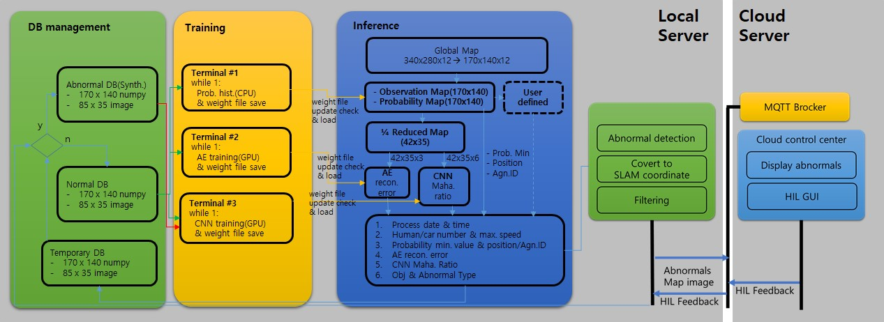

# Map Base Anomaly

These packages are related to anomaly detection using environment map. 

### Architecture

### Components
1. abnormal_map_generator: This software is a program that generates random abnormal situations for (1) object maps such as people and vehicles, (2) height maps, and (3) temperature maps in environment map creation and reflects them in abnormal situation learning. to be. In the case of the object map, people and vehicles within the range of numbers specified for the normal DB add random movement and are considered as object abnormalities. In the case of the height and temperature map, a random height and temperature change is added to the normal DB, and the abnormal distribution is determined based on the probability map, and the abnormal DB is generated.
2. map_trainer: This software is a program that (1) generates a probability map, (2) extracts and filters abnormal candidates, and (3) visualizes judgment information to users for multi-level environment map inputs generated from multi-monitoring agents. By analyzing statistical data for a multi-layered environment map for a given period, the probability of occurrence of the event is calculated, and the conversion is performed into an observation map and a probability map in the form of a grid map. Afterwards, anomalous candidates are extracted and filtered using an auto-encoder and a deep learning network based on CNN.
3. map_visualize: This SW is for environment maps created from multi-monitoring agents, (1) current monitoring area situation, (2) flow history of people and vehicles, (3) minimum/medium/maximum temperature history, (4) current point It is a program that converts information such as the lowest probability position, (5) the activity status of the monitoring agent, (6) the height distribution status, and (7) the temperature distribution status to the user.

#### Requirements
- ROS-Kinetic
  - grid_map
  - octomap_msgs
- Python 2.7
- TinyXML

### Contributor
* [✉️](mailto:creatrix@etri.re.kr) __신호철__ (Shin, HoChul)
#

