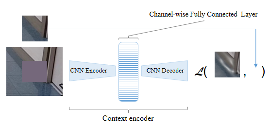

# Anomaly Detection using Inpainting

The inpainting model used in our approach is extended using an autoencoder. The network takes an input with a cut-out center area and attempts to reconstruct the missing region [1]. The usage of this model for anomaly detection is explored in this paper [2].

<table>
  <tr>
    <td valign="top">[1]</td>
    <td>Pathak, Deepak, Philipp Krahenbuhl, Jeff Donahue, Trevor Darrell, and Alexei A. Efros. <a href="https://arxiv.org/abs/1604.07379">Context encoders: Feature learning by inpainting.</a>.In <i>Proceedings of the IEEE conference on computer vision and pattern recognition</i>, pp. 2536-2544. 2016.
   </td>
  </tr>
  <tr>
    <td valign="top">[2]</td>
    <td>Muhammad Zaigham Zaheer, Marcella Astrid, Seung-Ik Lee, and Ho Chul Shin. <a href="https://ieeexplore.ieee.org/document/8571926">Ensemble grid formation to detect potential anomalous regions using context encoders.</a>. In <i>18th International Conference on Control, Automation and Systems (ICCAS)</i>, pp. 661-665. IEEE, 2018.</td>
  </tr>
</table>

### Requirements
- ROS-Kinetic
- Python
- pytorch
- numpy
- matplotlib
- scikit-learn
- Opencv-python

### Dataset
- Models are trained with our specific dataset. Please contact us.

### Contributor
* [✉️](mailto:mzz.pieas@etri.re.kr) __Muhammad Zaigham Zaheer__
#

