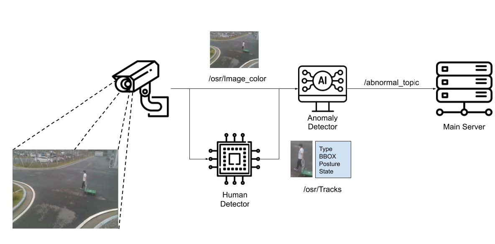

# Detection for Abnormal Pedestrians 
The project contains code to detect abnormal pedestrians.  It is still work in progress.

### Description

model_anomaly: The anomaly detection model is defined here. The model is trained based one-class classification scheme, built on top of an autoencoder architecture. Later, abnormal situations are detected through the thresholding of reconstruction errors.

ped_node: Modules for communication between the anomaly detection module and the server. Receives monitoring image and bounding box information and sends abnormal scores to the server.

### Requirements
- ROS-Kinetic
- Python==3.5.3
- Tensorflow==2.2.0
- numpy==1.16.1
- matplotlib==2.2.2
- scikit-learn==0.20.2
- tqdm==4.41.1
- Opencv-python==3.4.0.12

### Dataset
- Models are trained with our specific dataset. Please contact us.

### Contributor
* [✉️](mailto:jh_lee@etri.re.kr) __이진하__ (in Ha, Lee)
#

