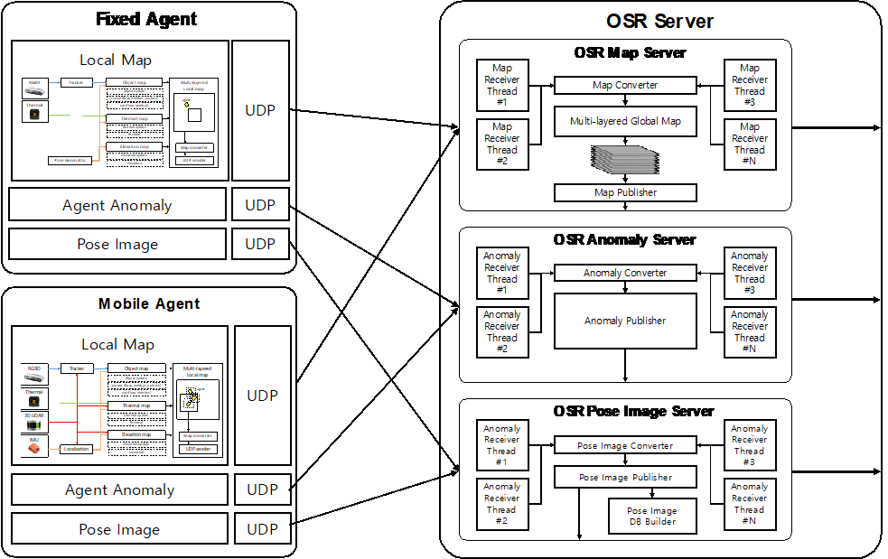
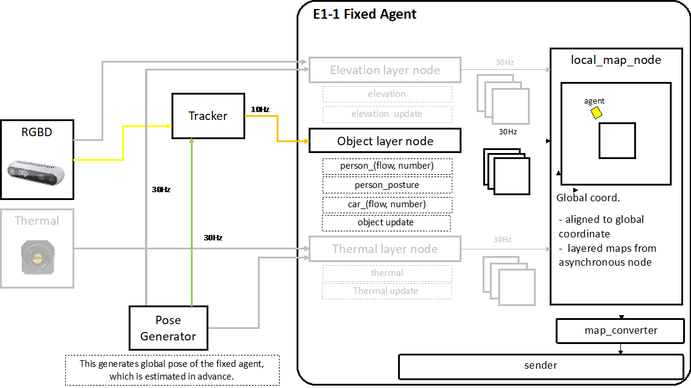
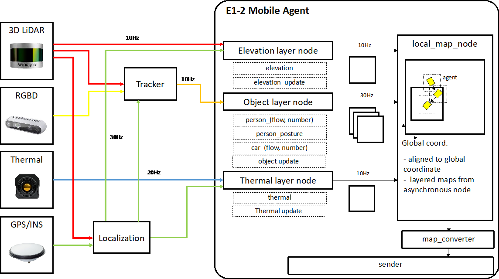

# Outdoor Security Robot(OSR)

These packages are related to fixed and mobile agents. These send data from agents like an image, pose, abnormal, and tracks.

- osr_agents: osr_agents generates fixed and mobile agent information and visualizes those in RVIZ
- osr_comm: osr_comm supports to communicate an image and abnormal between agents and server. This package provides a data format definition (packet), converting tools between ROS msgs and UDP packets (parse), and asynchronous UDP communication (comm)
- osr_demos: osr_demos provides senders and receivers for an image, pose and abnormals. This supports multi-ports communication from multi-agents at the same time.
- osr_msgs: osr_msgs provides ROS messages for abnormals, agent information, image with pose, and tracks.
- osr_pose: osr_pose generates fixed agent's pose by loading an agent pose saved in files.

### Agents 
There are two types of hardware architecture: fixed agents and mobile agents with different sensor configurations.

| Fixed Agent  | Moving Agent |
| ------------- | ------------- |
|   |  |

#### Requirements
- ROS-Kinetic
  - grid_map
  - octomap_msgs
- Python 2.7
- TinyXML

### Contributor
* [✉️](mailto:kina4147@etri.re.kr) __나기인__
#

