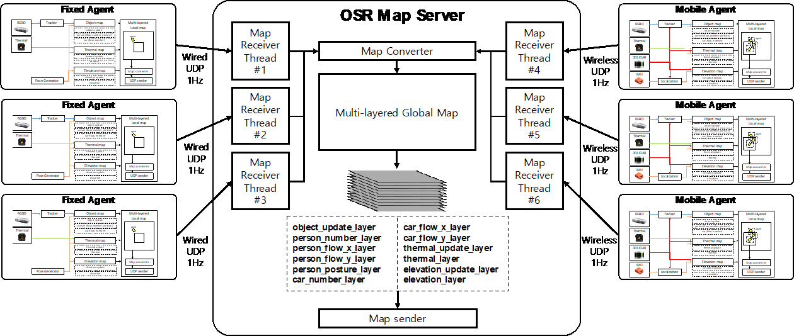

# osr_map

These packages are related to multi-agents map building. This builds a multi-layered maps in a large space by communicating between multi-agents and map server.

- osr_map_agents: osr_map_agents builds a multi-layered local map using multi-modal sensors for fixed agent and mobile agents. The multi-layered local map consists of elevation layer, object_layer, and thermal_layer. Each agent sends the multi-modal multi-layered local map to osr_map_server. This module currently supports for two sites (KIRO and RedOne). 
- osr_map_comm: osr_map_comm supports to communicate between agents and server. This package includes a data format definition (packet), converting tools between ROS msgs and UDP packets (parse), and asynchronous UDP communication (comm)
- osr_map_demos: osr_map_demos loads a top-view image and visualize it by projecting onto grid map in ROS RVIZ. 
- osr_map_server: osr_map_server gathers multi-layered local maps from fixed agents and mobile agents and build a global multi-layered map. This server supports multi-threads communication with multi-ports for multi-agents without a delay. 
- osr_map_mqtt: osr_map_mqtt is a module for transmitting the detected abnormal situation and map image to the cloud server, and used mqtt communication protocol.

### Requirements
- ROS-Kinetic
  - grid_map
  - octomap_msgs
- Python 2.7
- TinyXML
- paho-mqtt

### Contributor
* [✉️](mailto:kina4147@etri.re.kr) __나기인__
#

