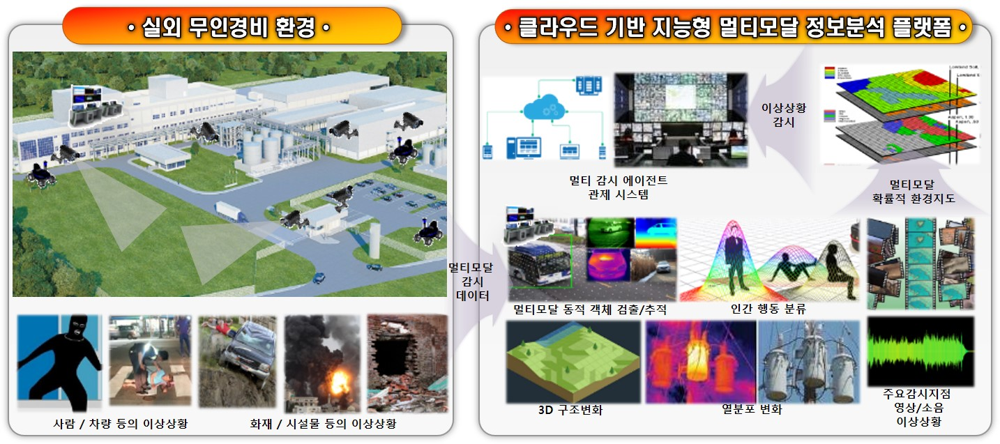

# Abnormal-Situation-Detection
This repository includes a program that creates an environment map from sensor information and detects abnormal situations through this environment map.
It is composed of OSR_based, which creates an environment map and manages communication of various data, and OSR_abnormal_detection, which detects abnormal situations from various information.

### Hardware/Software Specification
<table style="margin:auto;text-align:center">
  <tr>
    <td align="center">Fixed/Moving Agents</td>
    <td align="center">Server</td>
  </tr>
  <tr>
    <td align="center">Intel i5</td>
    <td align="center">Intel i7</td>
  </tr>
  <tr>
    <td align="center">NVIDIA GTX 1070M</td>
    <td align="center">NVIDIA GTX 1080Ti x2</td>
  </tr>
  <tr>
    <td align="center" colspan="2">Ubuntu 16.04</td>
  </tr>
  <tr>
    <td align="center" colspan="2">ROS Kinetic</td>
  </tr>  
</table>

### Dataset
- Models are trained with our specific dataset. Please contact us.

### Contributor
* [✉️](mailto:creatrix@etri.re.kr) __신호철__ (Shin, HoChul)
* [✉️](mailto:changjh@etri.re.kr) __장지호__ (Jiho Chang)
* [✉️](mailto:kina4147@etri.re.kr) __나기인__
* [✉️](mailto:mzz.pieas@etri.re.kr) __Muhammad Zaigham Zaheer__
* [✉️](mailto:jh_lee@etri.re.kr) __이진하__ (Jin Ha, Lee)
#
